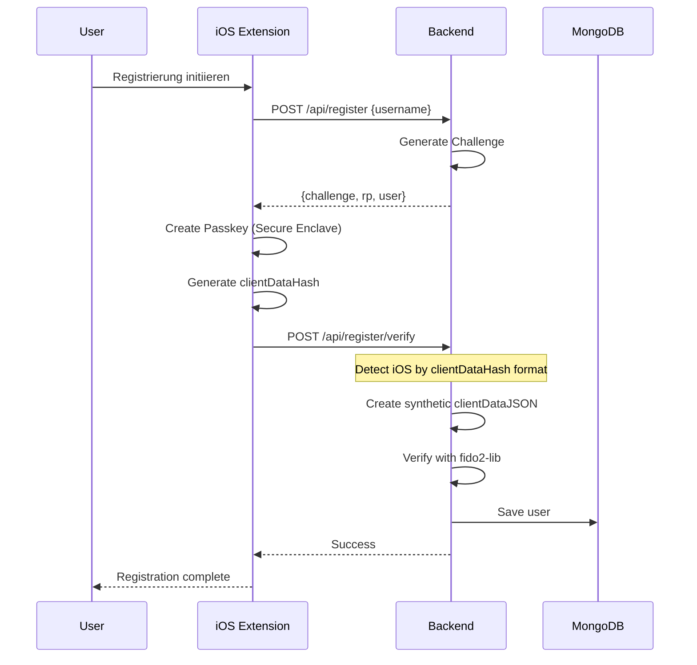
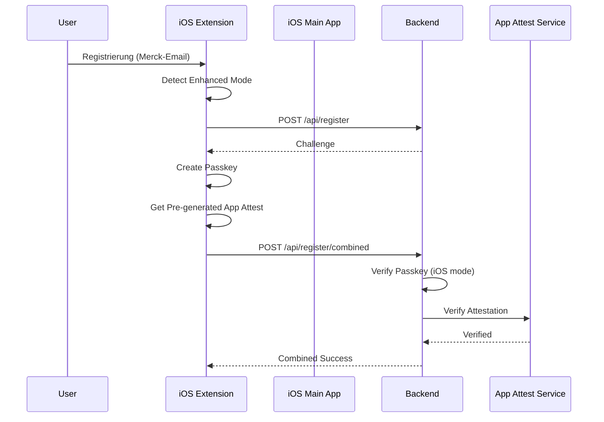

# PasskeyGuard: Detaillierte Analyse der Dual-Mode WebAuthn-Implementierung mit iOS App Attest Integration

## Inhaltsverzeichnis

1. [Einführung](#1-einführung)
2. [Architektur-Übersicht](#2-architektur-übersicht)
3. [Standard Registration Flow - Detaillierte Analyse](#3-standard-registration-flow)
4. [Enhanced Registration Flow - Detaillierte Analyse](#4-enhanced-registration-flow)
5. [App Attest Integration - Technische Details](#5-app-attest-integration)
6. [Sicherheitsanalyse und Angriffsszenarien](#6-sicherheitsanalyse-und-angriffsszenarien)
7. [Implementierungsdetails und Herausforderungen](#7-implementierungsdetails-und-herausforderungen)
8. [Fazit und Empfehlungen](#8-fazit-und-empfehlungen)

---

## 1. Einführung

### 1.1 Projektziel

Das PasskeyGuard-System implementiert eine duale WebAuthn-Registrierungsstrategie, die speziell für iOS-Umgebungen optimiert wurde. Das System unterscheidet zwischen zwei Modi:

1. **Standard Mode**: Traditionelle Passkey-Registrierung für die meisten Benutzer
2. **Enhanced Mode**: Kombinierte Passkey + App Attest Registrierung für hochsicherheitskritische Domains (Merck-Gruppe)

### 1.2 Technische Herausforderungen

Die Hauptherausforderung besteht in der iOS-spezifischen Limitation: iOS Credential Provider Extensions können nur einen `clientDataHash` (SHA-256 Hash) senden, nicht das vollständige `clientDataJSON` wie es der WebAuthn-Standard vorsieht. Diese Einschränkung erfordert spezielle Behandlung auf der Backend-Seite.

### 1.3 Warum zwei Modi?

Die Dual-Mode-Architektur wurde entwickelt, um unterschiedliche Sicherheitsanforderungen zu erfüllen:
- **Standard Mode**: Maximale Kompatibilität und Benutzerfreundlichkeit
- **Enhanced Mode**: Zusätzliche Geräteverifikation für kritische Unternehmensumgebungen

---

## 2. Architektur-Übersicht

### 2.1 Systemkomponenten

#### iOS-Komponenten:
1. **PasskeyGuardAutofill Extension**: Credential Provider Extension für Passkey-Operationen
2. **PasskeyGuardShared Framework**: Gemeinsame Logik zwischen App und Extension
3. **Hauptapp**: Konfiguration und App Attest Key-Generierung

#### Backend-Komponenten:
1. **Node.js Express Server**: WebAuthn-Endpunkte
2. **MongoDB**: Persistenz für User-Credentials
3. **Challenge Store**: Temporäre Challenge-Verwaltung
4. **iOS-spezifische Handler**: Verarbeitung von clientDataHash

### 2.2 Kommunikationsflüsse

```
Standard Flow:
iOS Extension → /api/register → Challenge
iOS Extension → /api/register/verify → Verification

Enhanced Flow:
iOS Extension → /api/register → Challenge
iOS Extension → /api/register/combined → Combined Verification
```

---

## 3. Standard Registration Flow - Detaillierte Analyse

### 3.1 Ablaufdiagramm



### 3.2 Schritt-für-Schritt-Analyse

#### Schritt 1: Challenge-Anforderung

```typescript
// iOS Extension Code
let challengeResponse = try await getServerChallenge(
    username: identity.userName, 
    rpId: identity.relyingPartyIdentifier
)
```

**Was passiert:**
- Die iOS Extension sendet Username und Relying Party ID
- Backend generiert eine kryptografisch sichere Challenge (32 Bytes)
- Challenge wird im Server-Memory mit Username als Key gespeichert
- Timeout: 120 Sekunden

**Warum:**
- Challenge verhindert Replay-Angriffe
- Bindung an spezifischen Registrierungsversuch
- WebAuthn-Standard-Konformität

#### Schritt 2: Passkey-Erstellung

```swift
let privateKey = try! SecureEnclaveService.shared.createPrivateKey(keyTag: keyTag)
let attestationObj = generateRegisterAttestionObject(
    rpID: relyParty,
    clientdataHash: clientDataHash,
    credsId: credsId,
    publicKey: publicKeyData
)
```

**Was passiert:**
- Private Key wird in iOS Secure Enclave erstellt
- Attestation Object wird nach WebAuthn-Spec generiert
- Format: "none" (Self-Attestation)
- AuthenticatorData enthält RP ID Hash, Flags, Counter, AAGUID

**Warum:**
- Secure Enclave garantiert Hardware-Sicherheit
- Private Key verlässt niemals das Gerät
- Biometrische Bindung (Face ID/Touch ID)

#### Schritt 3: Backend-Verifikation

```javascript
// Backend erkennt iOS clientDataHash
const isIOSHash = clientDataJSON && 
                  typeof clientDataJSON === 'string' && 
                  clientDataJSON.length < 50 && 
                  !clientDataJSON.startsWith('{') && 
                  !clientDataJSON.startsWith('ey');

if (isIOSHash) {
    // iOS-spezifische Behandlung
    const syntheticClientData = {
        type: "webauthn.create",
        challenge: serverChallenge,
        origin: origin,
        crossOrigin: false
    };
}
```

**Was passiert:**
- Backend erkennt automatisch iOS clientDataHash (43 Zeichen Base64)
- Erstellt synthetisches clientDataJSON für fido2-lib Kompatibilität
- Verifiziert Attestation Object und Public Key
- Speichert User in MongoDB

**Warum:**
- iOS Extensions können technisch kein vollständiges clientDataJSON erstellen
- Synthetisches JSON ermöglicht Verwendung von Standard-Libraries
- Kompatibilität mit WebAuthn-Ökosystem

### 3.3 iOS clientDataHash Problem im Detail

**Technischer Hintergrund:**
- iOS Extensions erhalten von Apple nur den SHA-256 Hash der clientData
- Dies ist eine Sicherheitsmaßnahme von Apple
- Der Hash kann nicht rückgängig gemacht werden

**Lösung:**
```javascript
// Original clientData (nicht verfügbar in iOS Extension):
{
    "type": "webauthn.create",
    "challenge": "base64-challenge",
    "origin": "https://example.com",
    "crossOrigin": false
}

// iOS sendet nur: SHA256(clientData) als Base64
"b0D43VTLrgn4xQlyFzrxHsMJSOpEDC0SYC_rJH0yN7g"
```

---

## 4. Enhanced Registration Flow - Detaillierte Analyse

### 4.1 Ablaufdiagramm



### 4.2 Domain-basierte Mode-Erkennung

```swift
public func getRegistrationMode(for identifier: String) -> RegistrationMode {
    if identifier.contains("@") {
        let domain = identifier.split(separator: "@").last.map(String.init) ?? ""
        return isDomainEnhanced(domain) ? .enhanced : .standard
    }
    return isDomainEnhanced(identifier) ? .enhanced : .standard
}

private let enhancedDomains = [
    "merck.com",
    "merckgroup.com", 
    "emdgroup.com"
]
```

**Was passiert:**
- Email-Domain wird extrahiert
- Prüfung gegen Whitelist von Enhanced-Domains
- Subdomain-Support (z.B. mail.merck.com)

**Warum:**
- Automatische Sicherheitserhöhung für kritische Domains
- Keine Benutzerinteraktion erforderlich
- Zentrale Konfiguration

### 4.3 App Attest Integration

#### 4.3.1 Pre-Generation Strategy

```swift
// In der Hauptapp (nicht Extension)
func preGenerateAttestations() async {
    for _ in 0..<poolSize {
        let keyId = try await DCAppAttestService.shared.generateKey()
        let localChallenge = generateLocalChallenge()
        let attestation = try await DCAppAttestService.shared.attestKey(
            keyId, 
            clientDataHash: localChallenge
        )
        saveToSharedContainer(attestation)
    }
}
```

**Was passiert:**
- Hauptapp generiert App Attest Keys im Voraus
- Keys werden mit lokalen Challenges attestiert
- Attestations werden in Shared Container gespeichert
- Extension kann pre-generated Attestations abrufen

**Warum:**
- Extensions können keine App Attest Keys generieren (Apple-Limitation)
- Pre-Generation ermöglicht nahtlose User Experience
- Pool-Strategie verhindert Verzögerungen

#### 4.3.2 Local Challenge Mechanismus

```swift
let formData: [String: Any] = [
    "username": username,
    "action": "register",
    "timestamp": ISO8601DateFormatter().string(from: Date()),
    "nonce": UUID().uuidString
]
let localChallenge = SHA256(formData)
```

**Was passiert:**
- Lokale Challenge bindet Attestation an spezifische Aktion
- Enthält Username, Aktion, Timestamp und Nonce
- SHA-256 Hash der Form-Daten

**Warum:**
- Verhindert Wiederverwendung von Attestations
- Bindet App Attest an spezifische Registrierung
- Zusätzliche Sicherheitsebene

### 4.4 Combined Registration Request

```typescript
interface CombinedRegistrationRequest {
    username: string;
    passkey: {
        credential: RegistrationCredential;
        challenge: string;
    };
    appAttest?: {
        keyId: string;
        attestationObject: string;
        localChallenge: string;
    };
    platform: "ios-extension";
}
```

**Was passiert:**
- Single Request enthält beide Attestations
- Passkey-Daten mit Server-Challenge
- App Attest-Daten mit Local Challenge
- Platform-Indikator für iOS-Handling

**Warum:**
- Atomare Operation (alles oder nichts)
- Reduzierte Netzwerk-Round-Trips
- Konsistente Fehlerbehandlung

---

## 5. App Attest Integration - Technische Details

### 5.1 Was ist App Attest?

App Attest ist Apples Geräteverifikationsdienst, der:
- Hardware-backed Attestation bietet
- Gerät-Authentizität bestätigt
- App-Integrität verifiziert
- Jailbreak-Detection unterstützt

### 5.2 App Attest im PasskeyGuard-Flow

#### 5.2.1 Attestation Object Struktur

```
{
    "fmt": "apple-appattest",
    "authData": [164 bytes],
    "attStmt": {
        "x5c": [2 certificates],
        "receipt": [3984 bytes]
    }
}
```

**Komponenten:**
- **fmt**: Format-Identifier (apple-appattest)
- **authData**: Authenticator Data mit Public Key
- **x5c**: Certificate Chain (Leaf + Intermediate)
- **receipt**: Signierter Receipt von Apple

#### 5.2.2 Verifikationsprozess

```javascript
// Backend App Attest Verification
async function verifyAppAttest(attestation) {
    // 1. CBOR dekodieren
    const decoded = cbor.decodeFirstSync(attestationBuffer);
    
    // 2. Certificate Chain validieren
    validateCertificateChain(decoded.attStmt.x5c);
    
    // 3. AuthData parsen
    const authData = parseAuthenticatorData(decoded.authData);
    
    // 4. Public Key extrahieren
    const publicKey = extractPublicKey(authData);
    
    // 5. Receipt validieren (Apple-Server)
    const receipt = await validateReceipt(decoded.attStmt.receipt);
    
    return { verified: true, publicKey, appId };
}
```

### 5.3 Sicherheitsvorteile von App Attest

1. **Hardware-Bindung**: Keys sind an Secure Enclave gebunden
2. **App-Integrität**: Erkennt modifizierte Apps
3. **Gerät-Authentizität**: Nur echte Apple-Geräte
4. **Anti-Replay**: Jede Attestation ist einzigartig

### 5.4 Limitationen und Workarounds

**Limitationen:**
- Nicht in Extensions verfügbar
- Requires iOS 14.0+
- Nur auf physischen Geräten
- Nicht im Simulator

**Workarounds:**
- Pre-Generation in Hauptapp
- Shared Container für Datenaustausch
- Pool-Management für Performance
- Graceful Degradation wenn nicht verfügbar

---

## 6. Sicherheitsanalyse und Angriffsszenarien

### 6.1 Threat Model

#### 6.1.1 Angreifer-Kategorien

1. **External Attacker**: Kein Zugriff auf Gerät oder Credentials
2. **Network Attacker**: Kann Netzwerkverkehr beobachten/manipulieren
3. **Malicious App**: Andere App auf demselben Gerät
4. **Compromised Device**: Jailbroken/kompromittiertes Gerät

#### 6.1.2 Assets zu schützen

1. **Private Keys**: In Secure Enclave
2. **User Credentials**: Passkeys
3. **Session Integrity**: Registrierung/Authentifizierung
4. **Corporate Data**: Merck-spezifische Ressourcen

### 6.2 Angriffsszenarien und Gegenmaßnahmen

#### 6.2.1 Replay-Angriffe

**Szenario:**
Angreifer fängt Registrierungsrequest ab und versucht erneute Verwendung.

**Schutzmaßnahmen:**
```javascript
// Server-seitige Challenge-Verwaltung
const challenge = generateChallenge();
storeChallenge(username, challenge, ttl: 120);

// Nach Verwendung
deleteChallenge(username);
```

**Wirksamkeit:**
- Challenge ist einmalig verwendbar
- Zeitbasiertes Ablaufen (120 Sekunden)
- Bindung an spezifischen User

#### 6.2.2 Man-in-the-Middle (MITM)

**Szenario:**
Angreifer positioniert sich zwischen Client und Server.

**Schutzmaßnahmen:**
1. **HTTPS/TLS**: Verschlüsselte Kommunikation
2. **Origin-Validation**: 
```javascript
const expectedOrigin = "https://www.appsprint.de";
if (clientData.origin !== expectedOrigin) {
    throw new Error("Invalid origin");
}
```
3. **Certificate Pinning** (iOS-Seite)

**Wirksamkeit:**
- TLS verhindert Abhören/Manipulation
- Origin-Check verhindert Phishing
- Pinning verhindert gefälschte Zertifikate

#### 6.2.3 Credential Stuffing

**Szenario:**
Verwendung gestohlener Credentials von anderen Diensten.

**Schutzmaßnahmen:**
- Passkeys sind domain-spezifisch
- Private Keys in Secure Enclave
- Biometrische Verifikation erforderlich

**Wirksamkeit:**
- Unmöglich, Passkeys zu stehlen oder zu kopieren
- Hardware-backed Security
- Phishing-resistent

#### 6.2.4 Malicious App Attacks

**Szenario:**
Bösartige App versucht, Passkey-Funktionalität zu missbrauchen.

**Schutzmaßnahmen:**
```swift
// App Group Protection
let appGroupID = "group.com.merckgroup.passkeyguard"
guard FileManager.default.containerURL(forSecurityApplicationGroupIdentifier: appGroupID) != nil else {
    throw SecurityError.unauthorizedAccess
}
```

**Enhanced Mode zusätzlich:**
- App Attest verifiziert App-Identität
- Bundle ID Validation
- Team ID Verification

**Wirksamkeit:**
- iOS App Sandboxing
- Cryptographic App Identity
- Keine Cross-App-Zugriffe möglich

#### 6.2.5 Device Compromise (Jailbreak)

**Szenario:**
Gerät ist jailbroken, Sicherheitsmechanismen umgangen.

**Standard Mode Schutz:**
- Begrenzt, da Secure Enclave weiterhin geschützt
- Biometrie kann kompromittiert sein

**Enhanced Mode Schutz:**
```javascript
// App Attest erkennt Jailbreak
if (appAttestResult.deviceProperties.jailbroken) {
    throw new Error("Device integrity check failed");
}
```

**Wirksamkeit:**
- App Attest erkennt viele Jailbreak-Methoden
- Secure Enclave bleibt geschützt
- Risiko-basierte Zugriffskontrolle möglich

#### 6.2.6 Backend Compromise

**Szenario:**
Backend-Server wird kompromittiert.

**Schutzmaßnahmen:**
1. **Keine Private Keys im Backend**: Nur Public Keys
2. **Minimal Data Storage**:
```javascript
// Nur notwendige Daten speichern
{
    username: "user@example.com",
    credentialId: "base64...",
    publicKey: "-----BEGIN PUBLIC KEY-----...",
    counter: 0
}
```
3. **Challenge Isolation**: Challenges im Memory, nicht persistent

**Wirksamkeit:**
- Keine sensitiven Daten zum Stehlen
- Angreifer kann keine gültigen Credentials erstellen
- Forward Secrecy durch einmalige Challenges

### 6.3 Spezifische Risiken der iOS-Implementierung

#### 6.3.1 Synthetisches clientDataJSON

**Risiko:**
Backend erstellt clientDataJSON anstatt es vom Client zu erhalten.

**Mitigation:**
```javascript
// Strikte Validierung
const syntheticClientData = {
    type: "webauthn.create", // Fest kodiert
    challenge: storedChallenge, // Vom Server generiert
    origin: "https://www.appsprint.de", // Fest kodiert
    crossOrigin: false // Fest kodiert
};
```

**Bewertung:**
- Akzeptables Risiko für iOS-Kompatibilität
- Keine zusätzlichen Angriffsvektoren
- Challenge-Binding bleibt erhalten

#### 6.3.2 Pre-Generated App Attest Keys

**Risiko:**
Keys werden vor tatsächlicher Verwendung generiert.

**Mitigation:**
- Kurze Lebensdauer (24 Stunden)
- Sichere Speicherung in Keychain
- Bindung durch localChallenge bei Verwendung

**Bewertung:**
- Notwendiger Kompromiss für Extension-Kompatibilität
- Sicherheit durch nachträgliche Challenge-Bindung
- Kein praktischer Angriffsvektor

### 6.4 Vergleichende Sicherheitsanalyse

| Aspekt | Standard Mode | Enhanced Mode |
|--------|---------------|---------------|
| Phishing-Schutz | ✅ Exzellent | ✅ Exzellent |
| Replay-Schutz | ✅ Vollständig | ✅ Vollständig |
| Device Binding | ✅ Secure Enclave | ✅ Secure Enclave + App Attest |
| Jailbreak Detection | ❌ Keine | ✅ Ja |
| App Integrity | ❌ Keine | ✅ Ja |
| Network Security | ✅ TLS | ✅ TLS |
| Biometric Protection | ✅ Ja | ✅ Ja |
| Hardware Security | ✅ Ja | ✅ Ja + Attestation |

---

## 7. Implementierungsdetails und Herausforderungen

### 7.1 iOS Extension Limitations

#### 7.1.1 Memory-Beschränkungen

```swift
// Extension Memory Limit: ~120MB
class ExtensionMemoryManager {
    static func checkMemoryUsage() {
        let memoryUsage = getMemoryUsage()
        if memoryUsage > 100 { // MB
            cleanupCaches()
        }
    }
}
```

#### 7.1.2 Keine App Attest API

**Problem:**
```swift
// In Extension - FEHLER
DCAppAttestService.shared.generateKey() // Nicht verfügbar
```

**Lösung:**
```swift
// In Hauptapp
let keys = generateKeyPool(size: 10)
saveToSharedKeychain(keys)

// In Extension
let key = loadFromSharedKeychain().first
```

#### 7.1.3 Eingeschränkte Netzwerk-APIs

Bestimmte Netzwerk-Funktionen sind in Extensions limitiert, erfordern optimierte Implementierung.

### 7.2 Backend-Herausforderungen

#### 7.2.1 Challenge-Verwaltung

```javascript
class ChallengeStore {
    constructor() {
        this.store = new Map();
        this.cleanupInterval = setInterval(() => {
            this.cleanup();
        }, 60000); // Jede Minute
    }
    
    cleanup() {
        const now = Date.now();
        for (const [key, value] of this.store.entries()) {
            if (now - value.timestamp > 120000) { // 2 Minuten
                this.store.delete(key);
            }
        }
    }
}
```

**Herausforderungen:**
- Memory-Management bei hohem Traffic
- Race Conditions bei parallelen Requests
- Cleanup von abgelaufenen Challenges

#### 7.2.2 iOS-Detection

```javascript
function detectIOSClientDataHash(clientDataJSON) {
    // Heuristiken für iOS-Erkennung
    if (!clientDataJSON) return false;
    if (typeof clientDataJSON !== 'string') return false;
    if (clientDataJSON.length !== 43 && clientDataJSON.length !== 44) return false;
    
    // Base64 URL-safe pattern
    if (!/^[A-Za-z0-9_-]+$/.test(clientDataJSON)) return false;
    
    // Kein JSON
    try {
        JSON.parse(Buffer.from(clientDataJSON, 'base64url').toString());
        return false; // Ist JSON, also kein Hash
    } catch {
        return true; // Ist kein JSON, wahrscheinlich Hash
    }
}
```

### 7.3 Performance-Optimierungen

#### 7.3.1 Caching-Strategien

```typescript
class UserCache {
    private cache = new LRUCache<string, User>({
        max: 1000,
        ttl: 300000 // 5 Minuten
    });
    
    async getUser(username: string): Promise<User> {
        let user = this.cache.get(username);
        if (!user) {
            user = await User.findOne({ username });
            if (user) this.cache.set(username, user);
        }
        return user;
    }
}
```

#### 7.3.2 Batch-Operationen

```swift
// Pre-generate multiple App Attest keys
func batchGenerateKeys(count: Int) async throws -> [AppAttestKey] {
    return try await withThrowingTaskGroup(of: AppAttestKey.self) { group in
        for _ in 0..<count {
            group.addTask {
                try await self.generateSingleKey()
            }
        }
        
        var keys: [AppAttestKey] = []
        for try await key in group {
            keys.append(key)
        }
        return keys
    }
}
```

### 7.4 Fehlerbehandlung und Recovery

#### 7.4.1 Graceful Degradation

```swift
do {
    attestation = try await getPreGeneratedAttestation()
} catch {
    logger.warning("App Attest nicht verfügbar, fahre ohne fort")
    // Fortsetzung ohne App Attest
    attestation = nil
}
```

#### 7.4.2 Retry-Mechanismen

```typescript
async function retryableRequest(fn: Function, maxRetries = 3) {
    for (let i = 0; i < maxRetries; i++) {
        try {
            return await fn();
        } catch (error) {
            if (i === maxRetries - 1) throw error;
            await sleep(Math.pow(2, i) * 1000); // Exponential backoff
        }
    }
}
```

### 7.5 Monitoring und Logging

#### 7.5.1 Strukturiertes Logging

```swift
let logger = Logger(subsystem: "com.merckgroup.passkeyguard", category: "Registration")

logger.info("🚀 Starting registration",
    metadata: [
        "user": .string(username),
        "mode": .string(mode.rawValue),
        "platform": .string("ios-extension")
    ]
)
```

#### 7.5.2 Metriken

```javascript
const metrics = {
    registrations: {
        total: new Counter('registrations_total'),
        success: new Counter('registrations_success'),
        failure: new Counter('registrations_failure'),
        duration: new Histogram('registration_duration_seconds')
    }
};

// Usage
const timer = metrics.registrations.duration.startTimer();
try {
    await registerUser(data);
    metrics.registrations.success.inc();
} catch (error) {
    metrics.registrations.failure.inc();
    throw error;
} finally {
    timer();
    metrics.registrations.total.inc();
}
```

---

## 8. Fazit und Empfehlungen

### 8.1 Erreichte Ziele

1. **Dual-Mode-Implementierung**: ✅ Erfolgreich umgesetzt
2. **iOS-Kompatibilität**: ✅ clientDataHash-Problem gelöst
3. **Enhanced Security**: ✅ App Attest integriert
4. **User Experience**: ✅ Nahtlose Registrierung

### 8.2 Sicherheitsbewertung

**Stärken:**
- Hardware-backed Security durch Secure Enclave
- Phishing-resistente Authentifizierung
- Zusätzliche Geräteverifikation für kritische Domains
- Keine Passwörter oder geteilte Geheimnisse

**Verbleibende Risiken:**
- Synthetisches clientDataJSON (akzeptables Risiko)
- Pre-generated App Attest Keys (mitigiert durch localChallenge)
- Abhängigkeit von Apple-Infrastruktur

### 8.3 Empfehlungen für Produktion

#### 8.3.1 Sicherheit

1. **Rate Limiting implementieren**:
```javascript
const rateLimiter = rateLimit({
    windowMs: 15 * 60 * 1000, // 15 Minuten
    max: 5, // Max 5 Registrierungen
    keyGenerator: (req) => req.body.username
});

app.post('/api/register', rateLimiter, registerHandler);
```

2. **Monitoring verstärken**:
- Anomalie-Erkennung für Registrierungsmuster
- Alerting bei App Attest Failures
- Geographic-basiertes Monitoring

3. **Certificate Pinning** für iOS App

#### 8.3.2 Skalierbarkeit

1. **Challenge Store**: Redis statt In-Memory
2. **Load Balancing**: Sticky Sessions für Challenge-Konsistenz
3. **Database Sharding**: Nach Username-Hash

#### 8.3.3 Compliance

1. **Audit Logging**: Alle Registrierungen protokollieren
2. **GDPR**: Recht auf Löschung implementieren
3. **Key Rotation**: Regelmäßige Rotation der Server-Keys

### 8.4 Zukünftige Erweiterungen

1. **Passkey Sync**: iCloud Keychain Integration
2. **Cross-Platform**: Android-Unterstützung
3. **Conditional UI**: Passkey-Verfügbarkeit prüfen
4. **Risk-Based Authentication**: Dynamische Sicherheitsstufen

### 8.5 Abschließende Bewertung

Das implementierte System stellt eine robuste und sichere Lösung für die spezifischen Anforderungen dar. Die Dual-Mode-Architektur ermöglicht flexible Sicherheitsrichtlinien basierend auf Organisationszugehörigkeit, während die iOS-spezifischen Anpassungen eine nahtlose Integration in das Apple-Ökosystem gewährleisten.

Die Verwendung von App Attest für Enhanced Mode bietet zusätzliche Sicherheitsgarantien, die besonders für Unternehmen im regulierten Umfeld (wie Merck) wichtig sind. Die Implementierung zeigt, wie moderne Authentifizierungsstandards mit platform-spezifischen Erweiterungen kombiniert werden können, ohne die Grundsicherheit zu kompromittieren.

**Gesamtbewertung: Production-Ready mit Minor Optimierungen**

Die Lösung ist bereit für den Produktiveinsatz, vorausgesetzt die empfohlenen Optimierungen werden umgesetzt. Die Architektur ist zukunftssicher und kann bei Bedarf erweitert werden.